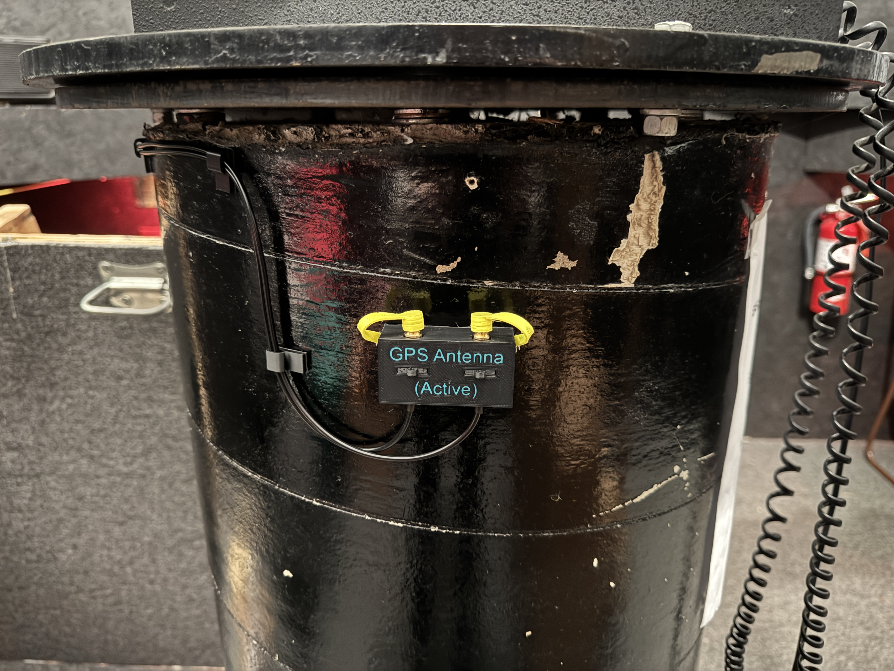
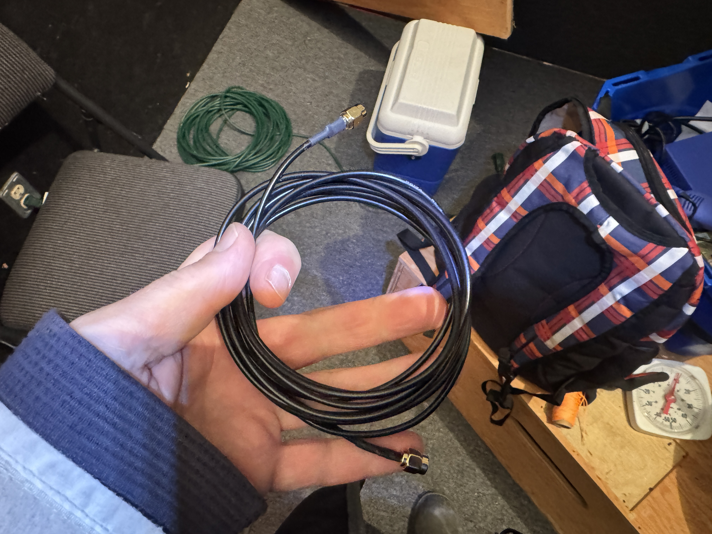
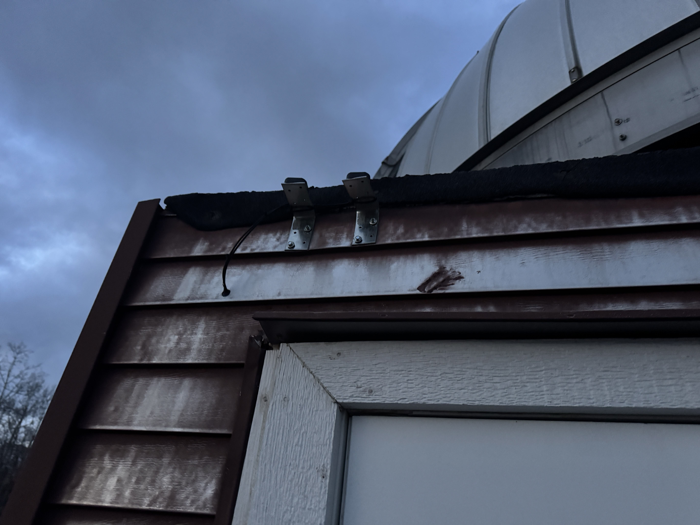
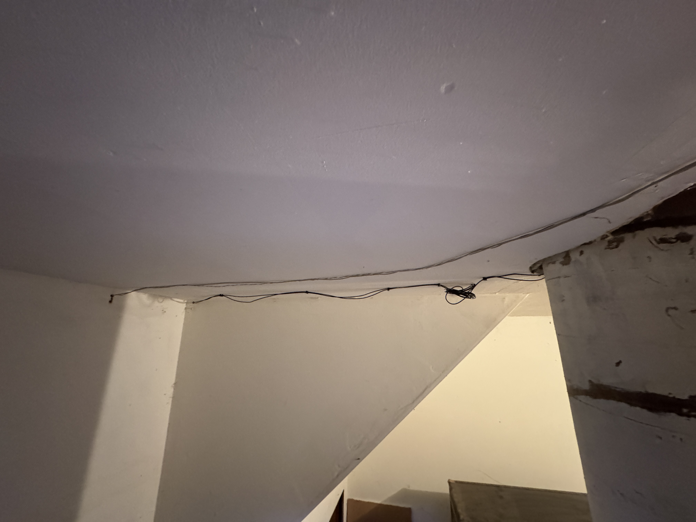

# GPS

## Introduction / Usage

**Please replace the yellow connector covers when connectors are not in use to prevent corrosion or dust.**

The dome now has 2 external active GPS antennas, which are available for connecting to, located on the pier, primarily for time and timing purposes. 

Because the dome is made of metal, it's difficult to get a reliable GPS signal within the dome without an external antenna.

One connection is for the OnStepX Goto Mount Controller (to provide date/time), and the second is for other use (typically Asteroid / Lunar Occultation Timing for Astrid or QHY174GPS). The connections end in an SMA Female connector, and a male-to-male SMA lead that will reach from there to the OTA can be found in a ziploc bag in the lens cupboard.

## Repair

### Overview

The antennas are located on the exterior to the left above the door, wired around the inside of the door frame and into the room underneath the dome, across the ceiling, and up the pier. 

### Antenna Replacement
 
There is a Male/Female SMA connector on each lead that's covered in heat shrink that can be found midway down the lefthand side of the door frame looking from the inside.  This is the connection point to replace the Active GPS Antenna, if it ever gets damaged by Hail etc.  Purchase information for the GPS antenna is:  [Bingfu Vehicle Waterproof Active GPS Navigation Antenna with SMA Male Connector](https://www.amazon.ca/dp/B07R7RC96G).  If the antennas are replaced, please be sure to recaulk the holes.

### Pier Connector Damage

The pier connectors contain a male-to-female adapter as a sacrificial connector in case of damage [Boobrie SMA Male to SMA Female Connector](https://www.amazon.ca/dp/B07FKNMPKD). To replace, use a pliers or piece of wire to pull out the tab holding the connector assembly in place and pull the wire out from the bottom, the connector will follow. Ensure new connector is tight and that all the Hex Nuts are in line with each other. Test fit the tab before placement, and put tab in after placement.

### 3D Printed Parts

3D printed files can be found in this folder. Clips and Bracket are mounted with 3M Extreme Mounting Tape. Bracket uses 2 x M3 Threaded Inserts, and 2 short M3 bolts and washers to attach the TPU covers to the the sides.