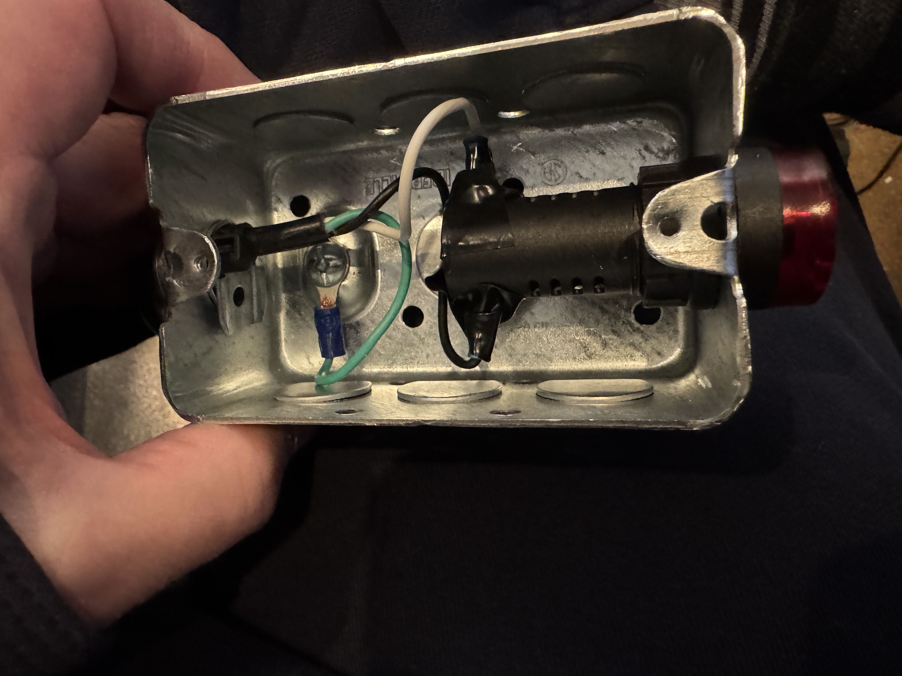

# Slit Alarm

## Introduction

In bad weather or in case of equipment failure, the motor controlling the slit in the WCO dome can re-engage if power is left on to the slit.  This can lead to significant damage (motor burnout or worse).

It is quite common for power to be left on by users due to forgetting to return the slit switch back to neutral after the bottom limit switch has been reached and the movement has stopped.

## Alarm

An alarm has been installed to solve this issue and consists of a 110V AC buzzer and red light, which activates during slit closure.  If the user forgets to switch off the slit power by returning the switch to neutral, the buzzing continues as a reminder to the user to return the switch to normal.  It only activates on slit closure, not on opening, it is up to the user to remember on opening, as the user is present, this is less critical than after the user has left.

The alarm has been installed in an external metal box that is grounded to the main switch box. The 110V for the switch is supplied via 2 contacts in the main switch box, which are engaged to 110V when the slit is being closed. The part number for the alarm is [uxcellAC/DC 110V 20mA Equipment Alarm Signal Indicator Light Flash Buzzer](https://www.amazon.ca/dp/B015SK2OM8?ref=ppx_yo2ov_dt_b_fed_asin_title) and is CE rated.

https://github.com/ChasinSpin/SkyPilot/main/dome/SlitAlarm/IMG_9700.MOV

https://user-images.githubusercontent.com/ChasinSpin/SkyPilot/main/dome/SlitAlarm/IMG_9700.MOV

https://user-images.githubusercontent.com/6877923/115474571-03c75800-a23e-11eb-8096-8973aad5fa9f.mp4

https://user-images.githubusercontent.com/6877923/123006036-64e2e780-d3b7-11eb-922e-018994b32da5.mov

Image inside (note box contains 110V to the switch + Ground to the box). To remove power, unplug the lead powering slit.  Electrical tape has been added to cover a small part of the exposed ring terminal if the case is open.

Please note that if servicing the main switch, the metal case is grounded by a lead and ring terminal that is trapped between the case and case screw (same as before).  Important to ensure this ring terminal is installed correctly to maintain grounding on both the switch case and the alarm case.  Always check grounding to both cases after reassembly.